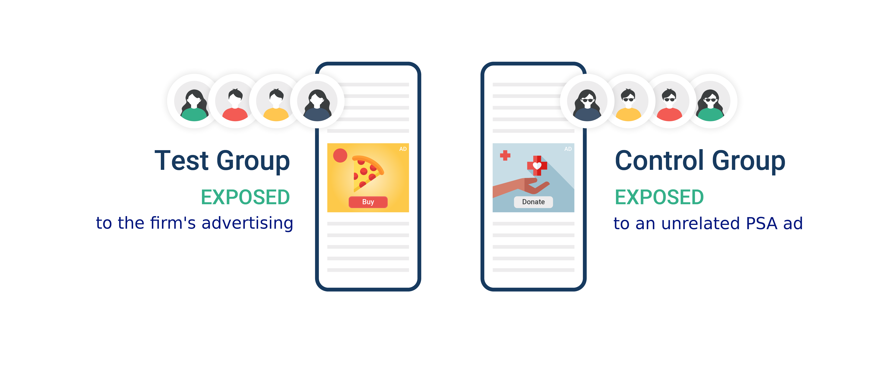
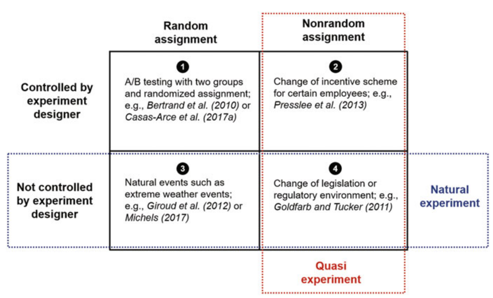
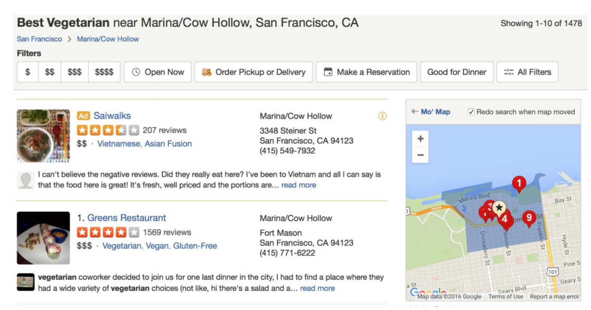
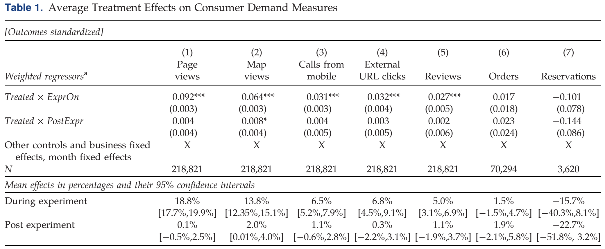
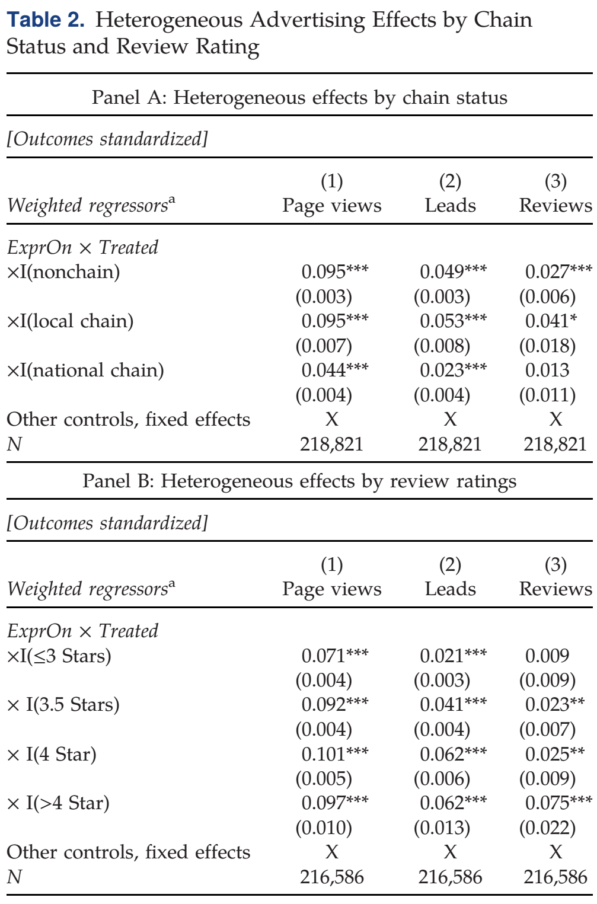
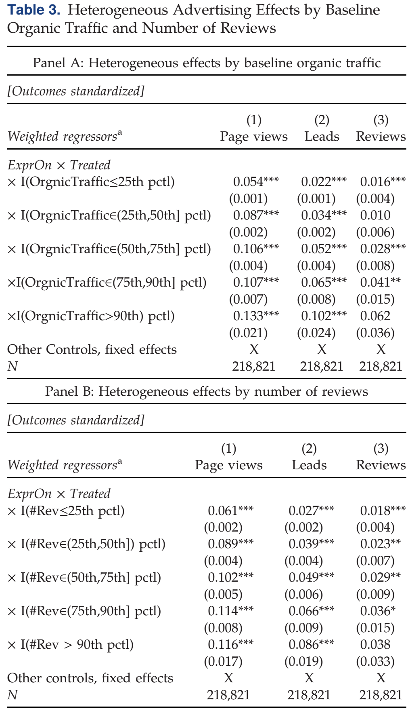
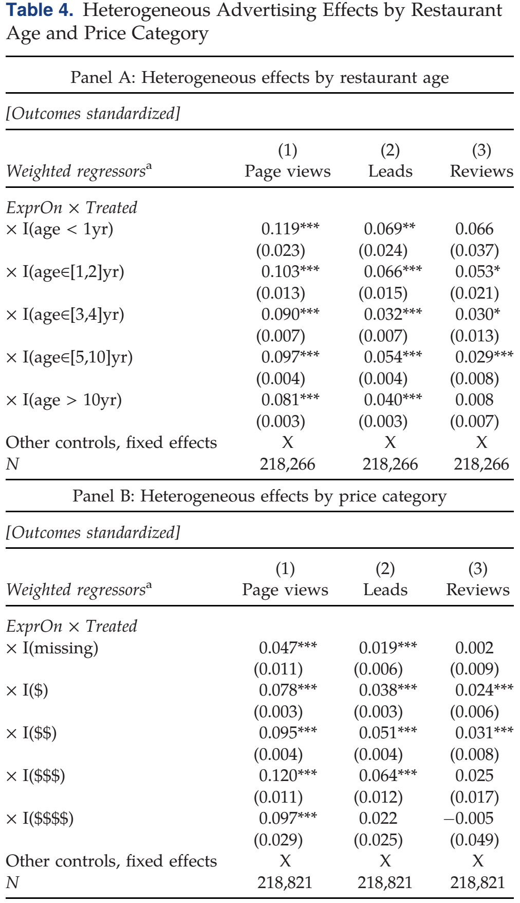

class: font160

# Learning Goals for this Week

At the end of this lecture, you should be able to:

* Explain the similarities and differences between PSA ad and Ghost Ad experiments
* Explain the workings of the "Ghost Ad" methodology at an intuitive level
* Apply the difference in differences methodology to analyze data from field experiments
* Explain why advertising context matters online 
* Discuss an approach to measure the value of advertising context 
* Distinguish firm attributes that make online advertising more effective 

---
class: inverse, center, middle

# Preliminaries

---
class: font160
# Where Are We Now? 

Course Themes:

1. Classical Approaches to Measuring Advertising Effects
2. **Modern Evaluation of Digital Advertising Effects**
2. User Generated Content & Social Media
3. Email & Mobile Marketing
4. Issues in (Massive) Online Marketplaces
5. Impact of Privacy Regulations 

---
# Wasteful Advertising Expenditures? 

```{r, echo = FALSE, fig.align = "center", out.width="100%"}
url <- "figs/wannamaker.png"
knitr::include_graphics(url)
```

.right[
Source: [Papergreat Blog](http://www.papergreat.com/2012/09/saturdays-postcard-wanamakers-and-1911.html)
]

---
class: font150
# Measuring Advertising Response

`r icons:::icon_style(icons::fontawesome("bullseye", style = "solid"), scale = 1)`
**The goal of any marketing campaign is to increase sales** 

* Either short-term or long-term

`r icons:::icon_style(icons::fontawesome("question", style = "solid"), scale = 1)`
**How to evaluate the performance of marketing?**

Each campaign / channel is evaluated on incremental profit that it produces relative to its cost 

$$
ROI = \frac{\text{incremental profit due to advertising} - \text{cost of advertising}}{\text{cost of advertising}}
$$

Outcomes we care about today:

* Correlates of incremental profit*

---
class: font160
# Our learning journey... 

.center[.font120[Popular techniques for estimating the incremental sales due to advertising]]

*Previously*: Marketing Attribution Rules & Media Mix Modelling

* Relies on *observational* data 

*Last Time*: *Intro to Field Experiments* 

* What are they? Why we run them? How to analyse the data?

**Today**: **Experiments with Online Display Advertising**

* Is it effective? How can we measure casual effect?

---
# What are Display Ads?

> A type of paid online advertising, display media consists of text, image, video, audio, and motion ads, which display on websites, apps, and social media platforms. These ads can appear in several sizes, including banner and reach users across the web.

```{r, echo = FALSE, fig.align = "center", out.width="100%"}
knitr::include_graphics("https://www.webfx.com/wp-content/uploads/2021/11/display-ad-example.png")
```

.font70[Source: [WebFX(2023)](https://www.webfx.com/digital-advertising/glossary/what-is-display-advertising/)]


---
# Online Advertising is HUGE!


```{r, echo = FALSE, fig.align = "center", out.width="60%"}
knitr::include_graphics("figs/digital_ad_spend.png")
```

---
class: font160
# The Business Problems

.center[`r icons:::icon_style(icons::fontawesome("bullseye", style = "solid"), scale = 1)`
*Seeking Answers to Strategic Questions:*]

**Are online display ads effective?**

* Methodologies: *Public Service Ads* & *Ghost Ads*
* Discussion based on [Johnson, Lewis and Nubbemeyer (2017)](https://doi.org/10.1509/jmr.15.0297)

**Does the context of where an ad appears matter?**

* Methodology: *Natural Experiment* and *Difference in Differences*
* Discussion based on [Ada, Abou Nabout and McDonnel Feit (2022)](https://doi.org/10.1177%2F00222437211070219)

**What kind of firms gain most from digital advertising?** 

* Methodology: Field Experiment and Difference in Differences 
* Discussion based on [Dai, Kim and Luca (2023)](https://pubsonline.informs.org/doi/pdf/10.1287/mksc.2023.1436)


---
class: inverse, center, middle

# Are online display ads effective?

---
# Online Display Ads

```{r, echo = FALSE, fig.align = "center", out.width="120%"}
knitr::include_graphics("https://www.webfx.com/wp-content/uploads/2021/11/display-ad-example.png")
```

.font70[Source: [WebFX(2023)](https://www.webfx.com/digital-advertising/glossary/what-is-display-advertising/)]

---
# How did THAT ad get to appear?


```{r, echo = FALSE, fig.align = "center", out.width="45%"}
knitr::include_graphics("figs/oda_auction.png")
```

*Source: [Singlegrain](https://www.singlegrain.com/marketing-automation/5-trends-that-will-define-the-new-vision-of-marketing-automation/)*

---
class: font130
# Difficulty is not always perceived!

.pull-left[
```{r, echo = FALSE, fig.align = "center", out.width="100%"}
knitr::include_graphics("https://upload.wikimedia.org/wikipedia/commons/thumb/4/44/Magid_Abraham_-_World_Economic_Forum_on_Latin_America_2009.jpg/1920px-Magid_Abraham_-_World_Economic_Forum_on_Latin_America_2009.jpg")
```

Magid M. Abraham, Co-Founder of ComScore
]

.pull-right[

"Measuring the online sales impact of an online ad or a paid-search campaign—in which a company pays to have its link appear at the top of a page of search results—is straightforward: We determine who has viewed the ad, then compare online purchases made by those who have and those who have not seen it."

M. Abraham, 2008. [Harvard Business Review](https://hbr.org/2008/04/the-offline-impact-of-online-a)

]

<br>

.center[
`r icons:::icon_style(icons::fontawesome("question", style = "solid"), scale = 1)`
**What's missing from this statement?**
]

---
# A Working Example

```{r, echo = FALSE, fig.align = "center", out.width="90%"}
knitr::include_graphics("figs/banner_ad.png")
```


---
class: font160
# What is the right counterfactual? 

```{r, echo = FALSE, fig.align = "center", out.width="100%"}
knitr::include_graphics("figs/macy_counterfactual.png")
```

`r icons:::icon_style(icons::fontawesome("question", style = "solid"), scale = 1)`
Should we compare to:

* No Ads?
* A different sequence of Ads?
  * If so, which sequence?

---
class:font160
# What Ad to Show Instead? 

<br>

Two alternative sequences of ads have been studied:

1. **Public Service Ads**
  * Replace firm's ads with ads for NGO or charity
2. The **"second best" ad** in the auction
  * Called "**Ghost Ads**" in the literature

We'll talk through each methodology

---
class: font130
# Public Service Ads Experiment

```{r, echo = FALSE, fig.align = "center", out.width="90%"}

```

Randomised Control Trial (i.e. an Experiment) 

* Users are split into two groups: 
  * **Control condition**
      * Users sees public service announcement ads - ads that help raise social awareness
  * **Treatment** (aka Test) **condition** 
      * Users see the company's ad as usual

---
class: font120
# Public Service Ads Experiment

```{r, echo = FALSE, fig.align = "center", out.width="90%"}

```

**Main idea:** 

By serving these real, alternative ads, we obtain the information on which users would have been exposed to the company's ad if the experiment did not allocate them to see PSA ads.


**Remark**:

To show the PSA alternative, you have to win the auction and choose to serve a different ad!

---
# PSA Ads in Context 

```{r, echo = FALSE, fig.align = "center", out.width="100%"}
knitr::include_graphics("figs/macys_psa.png")
```

---
# The PSA Ad Sequence

```{r, echo = FALSE, fig.align = "center", out.width="100%"}
knitr::include_graphics("figs/psa_experiment.png")
```

---
class: font140
# PSA Experiments are Costly!

```{r, echo = FALSE, fig.align = "center", out.width="90%"}
knitr::include_graphics("figs/psa_cost.png")
```

.center[
`r icons:::icon_style(icons::fontawesome("question", style = "solid"), scale = 1)`
Do I want to spend half my budget on PSAs every time I run a campaign?
]

---
# PSAs are the WRONG Baseline

```{r, echo = FALSE, fig.align = "center", out.width="70%"}
knitr::include_graphics("figs/psa_baseline_01.png")
```

<br>

.center[
 Red Cross doesn't run PSAs to Macys target consumers when Macys stops its advertising. 
]

---
# PSAs are the WRONG Baseline

```{r, echo = FALSE, fig.align = "center", out.width="70%"}
knitr::include_graphics("figs/psa_baseline_02.png")
```

<br>

.center[
This Control group reflects advertiser's true strategic environment
]

---
# Towards a Solution: Ad Logs

```{r, echo = FALSE, fig.align = "center", out.width="100%"}
knitr::include_graphics("figs/psa_baseline_03.png")
```

---
class: font130
# Ghost Ads

```{r, echo = FALSE, fig.align = "center", out.width="70%"}
url <- "https://www.ama.org/wp-content/uploads/2019/01/ghost-ads-image.jpg?resize=1170%2C550"
knitr::include_graphics(url)
```

**Ghost Ads**: Identify ads among control group that *would have been* treatment ads *if* user was in treatment group

* **Treatment group**: user who see **your company's ad** (Macy's in this example)
* **Control group**: user sees **whatever ad platform chooses to deliver**

---
# Ghost Ads: Implementation

```{r, echo = FALSE, fig.align = "center", out.width="120%"}
url <- "figs/ghost_ads_flow.png"
knitr::include_graphics(url)
```

<br>

.center[
**Analysis**: Compare behaviour of users in treatment and control group
]

---
# Ghost Ads: Identifying

```{r, echo = FALSE, fig.align = "center", out.width="70%"}
knitr::include_graphics("figs/ghost_ads_idea.png")
```

<br>

.center[

Control users would have seen Macy's ads: Log the ads!

]

---
# Ghost Ads: Logging

```{r, echo = FALSE, fig.align = "center", out.width="100%"}
knitr::include_graphics("figs/ghost_ads_log.png")
```

---
# Ghost Ads: Logging

```{r, echo = FALSE, fig.align = "center", out.width="100%"}
knitr::include_graphics("figs/ghost_ads_log_02.png")
```

---
class: font160
# Ghost Ads in Practice

```{r, echo = FALSE, fig.align = "center", out.width="40%"}
url <- "https://image4.owler.com/logo/defshop-kg_owler_20170831_121955_large.jpg"
knitr::include_graphics(url)
```

```{r, echo = FALSE, fig.align = "center", out.width="50%"}
url <- "https://fashionunited.com/cdn-cgi/image/fit=cover,format=auto,gravity=center,height=463,quality=70,width=694/https://fashionunited.com/img/upload/2021/12/13/dscf6354-defshop-koeln11-1-dw3cwbas-2021-12-13.jpeg
"
knitr::include_graphics(url)
```

**Case Study**: Def Shop 

* An online platform that allows users to shop for hip-hop clothing, footwear and accessories.

.font70[[FashionUnited.de (2021)](https://fashionunited.de/nachrichten/business/defshop-ceo-franco-luca-die-planungssicherheit-vor-corona-gibt-es-nicht-mehr/2021121344238)]

---
class: font160
# The DefShop Experiment 

Motivation:  

> "We're a family business ... we’re naturally forced to double-check every cent we invest. For us it's about ... being as profitable as possible."

In the Ad marketplace: 

> "going from having only a feeling of what our ads might be driving to actually knowing their direct impact. And knowing is a much better feeling!" 

---
class: font160
# DefShop Experiment Details 

**Customer Segment**: Product and Cart Abandoners 


```{r, echo = FALSE, fig.align = "center", out.width="60%"}
url <- "https://www.vpcart.com/images/blog/Cart-Abandonment-2.png"
knitr::include_graphics(url)
```

.font70[Source: [VP Cart (2019)](https://www.vpcart.com/blog/abandoned-cart/)]


---
class: clear

```{r, echo = FALSE, fig.align = "center", out.width="50%"}
url <- "https://koronapos.com/wp-content/uploads/2019/07/942097_2-New-Infographs_2_011221.png.webp"
knitr::include_graphics(url)
```

.font70[Source: [Korona Pos (2021)](https://koronapos.com/blog/reasons-for-abandoned-carts/)]

---
class: font140
# DefShop Experiment: Results

```{r, echo = FALSE, fig.align = "center", out.width="66%"}
knitr::include_graphics("figs/defshop_case.png")
```

Experiment Duration: 3 weeks

**Outcomes**:

* **Purchases**: increase by 12%
* **Site Visits**: increase by 23%
* **Brand Search Queries**: increase by 38%

---
class: font160
# Takeaways 

<br>

* Measuring display ad effectiveness is difficult

* Two experimental paradigms to measure casual effects:
  * Public Service Ads (PSAs)
  * Ghost Ads 

* Ghost Ads overcome the shortcomings from PSAs 

---
class: inverse, center, middle

# Does the context of where an ad appears matter?

---
class: clear, font160

```{r, echo = FALSE, fig.align = "center", out.width="60%"}
knitr::include_graphics("figs/ad_context_part.png")
```

.center[
`r icons:::icon_style(icons::fontawesome("question", style = "solid"), scale = 1)`
**Why might context matter?**
]

---
class: font160
# Prevailing Thoughts 

Prior to this paper ... 

* Emphasis on **user targeting**
  - Advertiser should only care about who sees the ad and not where they see it

* User information is what advertisers should value

* BUT, User info increasingly limited due to changing privacy regulation 

* Are there other ways to target ads to consumers? 
  - One alternative: website subdomains (e.g., www.nytimes.com/section/business)

---
class: font160
# Studying Advertising Context Effects

<br>

How the researchers proceed: 

* Studied a policy change at a major private ad exchange

Policy change $\implies$ Natural Experiment 

.center[
`r icons:::icon_style(icons::fontawesome("question", style = "solid"), scale = 1)`
**What is a Natural Experiment?**
]

---
class: font140
# 'Other' Types of Experiments

```{r, echo = FALSE, fig.align = "center", out.width="80%"}

```

.font70[Source: [Artz & Doering (2023)](https://doi.org/10.1007/978-3-319-57413-4)]

Remark: Once we move away from the "classical" experiment, how we analyze the data must change too!

---
class: font160
# Analyzing Natural Experiments 

**Key Difference**: Treatment and Control units might differ systematically 

* i.e. average behaviour might differ

<br>

|                     | Before | After |
|---------------------|--------|-------|
| **Control Group**             | $\beta_0$      |  $\beta_0 + \beta_1$     |
| **Treatment Group**           | $\beta_0 + \beta_2$       |   $\beta_0 + \beta_2 + \beta_1 + \delta$    |

$\delta$ is the effect of the experiment 

.center[
`r icons:::icon_style(icons::fontawesome("question", style = "solid"), scale = 1)`
**How can we recover it?**
]

---
class: font160 
# Estimating the Treatment Effect

|                     | Before | After | After - Before |
|---------------------|--------|-------|----------------|
| **Control Group**             | $\beta_0$      |  $\beta_0 + \beta_1$     |    $\beta_1$            |
| **Treatment Group**           | $\beta_0 + \beta_2$       |   $\beta_0 + \beta_2 + \beta_1 + \delta$    |  $\beta_1 + \delta$               |
| **Treatment - Control** | |  |    $\delta$            |

<br>

$\implies$ we can estimate the **average treatment effect**

**Assumption**: Parallel trends 

* if Treatment Group did not receive treatment, average would also have increased by $\beta_1$

$\rightarrow$ This is *crucial* and untestable*

---
class: font160 
# Estimating the Treatment Effect

<br>

|                     | Before | After | After - Before |
|---------------------|--------|-------|----------------|
| **Control Group**             | $\beta_0$      |  $\beta_0 + \beta_1$     |    $\beta_1$            |
| **Treatment Group**           | $\beta_0 + \beta_2$       |   $\beta_0 + \beta_2 + \beta_1 + \delta$    |  $\beta_1 + \delta$               |
| **Treatment - Control** | |  |    $\delta$            |

<br>

Can recover $\delta$ via a regression:

$$
\begin{align*}
y_{it} = \beta_0 &+ \beta_1 After_{t }+ \beta_2 TreatmentGroup_{i} + \\
                 &\delta \, TreatmentGroup_{i} \, \times \, After_{t} + \varepsilon_{it}
\end{align*}
$$

---
class: font130
# Ad Context: The Natural Experiment 

Platform: Anonymous Private Ad Exchange in EU 

* Private Ad Exchange? 
  - Sells display ad impressions at approx. 100 reputable websites
  - Buyers of ads are pre-approved

Implementation:

* **Treatment**: Buyer given information where subdomain appears
  - Starting May 2016 

* **Treatment Group**: Sites in 2016
* **Control Group**: Sites in 2015

* **Before**: January through April of a given year 
* **After**: May through December of a given year

Note: control group is an 'old version of ones-self' 


.center[
`r icons:::icon_style(icons::fontawesome("question", style = "solid"), scale = 1)`
**Why not simply 2016 data, before vs after change?**
]


---
# Main Result

```{r, echo = FALSE, fig.align = "center", out.width="45%"}
knitr::include_graphics("figs/ad_context_did_table.png")
```

---
class: font160
# Implications for Marketers

Main Findings:

* Ad context matters to advertisers 
* They are willing to pay more for it 
* $\implies$ willing to pay for *right* placement

Intuitively: 

* Ad for makeup conveys a different message when placed in in a high-end fashion magazine versus on the business page of a newspaper 

Limitation on generalizability: Extremely niche sites 

---
class: inverse, center, middle

# What kind of firms gain most from digital advertising?

---
# Unequal Returns to Digital Advertising?

**Motivation** 

* Huge variation in the estimates of returns to advertising
* Existing work (typically) focuses on large firms 

**Specific Questions**

* Which firms are most likely to benefit from digital ads?
* Are there generalizable findings across firm attributes?

**How**

* Field Experiment at Yelp.com

---
# Advertising on Yelp.com

```{r, echo = FALSE, fig.align = "center", out.width="100%"}

```

---
class: font150
# The Experiment 

**Platform**: Yelp.com  

**Population studied**: US Restaurants listed on Yelp

**Treatment**: Receive 'Standard' advertising package for free over 3 months

* August through October 2015

**Sample**: 18,294 restaurants, 50-50 treatment/control split

**Analysis**: Difference in Differences*

---
class: font130
# Main Results: Average Effects 

```{r, echo = FALSE, fig.align = "center", out.width="90%"}

```

**Findings**: 

* Ads increase page view, map views, calls, clicks to own website and reviews during the experiment
* Limited carryover after experiment*

**Remark**: Outcomes Standardized $\implies$ one unit change $\leftrightarrow$ one standard deviation

* Same for all tables to follow

---
class: font160
# Heterogeneity: Chains & Ratings

.pull-left[
```{r, echo = FALSE, fig.align = "center", out.width="100%"}

```
]

.pull-right[

<br>

**Findings:** 

* Smaller effects for chains
  * Consistent with ads informing consumers and signalling quality
* Larger effects for higher rated

]

---
class: font160
# Heterogeneity: Traffic & Reviews

.pull-left[
```{r, echo = FALSE, fig.align = "center", out.width="80%"}

```
]

.pull-right[

<br>

**Findings:** 

* Larger effects if higher pre-experiment traffic
* Larger effects if larger number of existing reviews

$\rightarrow$ consistent with a reminder effect of advertising

]

---
class: font160
# Heterogeneity: Age & Price Tier

.pull-left[
```{r, echo = FALSE, fig.align = "center", out.width="80%"}

```
]

.pull-right[

<br>

**Findings:** 

* Larger effects for younger restaurants
* Larger effects "medium" price tier

]

---
class: font160
# Implications for Marketers

Who benefits more from digital advertising?

* Independent firms and 
* Higher quality firms
* Larger firms (in terms of traffic)

---
class: inverse, center, middle

# Recap

---
class: font160
# Summary 

* Ghost Ads presents an experimental framework to study causal effects of online display ads 
  * Creates a log entry where an ad wins an auction but shows the second ad 
  * i.e. a competitor in the ad auction 
  * Which is a "better" control group than serving PSA ads 

* Online display ads are more effective when placed in contexts that better match the brand/product
  * The idea that context matters is relatively new 

* Digital ads are appear more effective for independent, and high quality firms

---
class: font160
# Acknowledgements 

These slides borrow quite heavily from two sources: 

* Garret Johnson's slides on ["Ghost Ads"](https://www.youtube.com/watch?v=Z709DAPpSMY) presented at the Advertising Research Foundation
  * Figures in the section "Ghost Ads" that are not referenced are directly borrowed from these slides
* Think with Google's ["Def Shop Case Study"](https://services.google.com/fh/files/misc/defshop_case_study.pdf)
* Ella McDonnel Feit's blog post: ["Ad Context Matters"](https://www.linkedin.com/pulse/ad-context-matters-elea-mcdonnell-feit/)

---
# License & Citation

Suggested Citation:

```{r, engine='out', eval = FALSE}
@misc{deerdsms2023,
      title={"Digital and Social Media Strategies: Online Display Advertising"},
      author={Lachlan Deer},
      year={2023},
      url = "https://github.com/deer-marketing-lab/dsms-lecture-online-display-ads"
}
```

<p style="text-align:center;"></p>

This course adheres to the principles of the Open Science Community of Tilburg University. 
This initiative advocates for transparency and accessibility in research and teaching to all levels of society and thus creating more accountability and impact.

<p style="text-align:center;"></p>
This work is licensed under a <a rel="license" href="http://creativecommons.org/licenses/by-sa/4.0/">Creative Commons Attribution-ShareAlike 4.0 International License</a>.