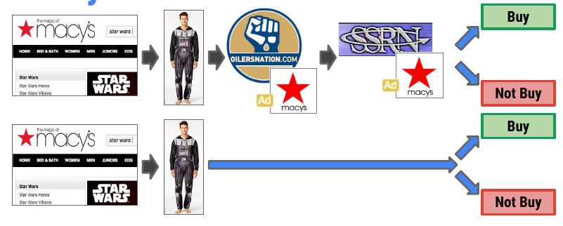

class: font160

# Learning Goals for this Week

At the end of this lecture, you should be able to:

* Explain the difficulties faced in measuring advertising effectiveness 
* Identify why previous approaches to advertising effectiveness (e.g. PSAs) aren't optimal 
* Explain the workings of the "Ghost Ad" methodology at an intuitive level
* Explain why advertising context matters online 
* Discuss an approach to measure the value of advertising context 

---
# Online Advertising is HUGE!


```{r, echo = FALSE, fig.align = "center", out.width="60%"}

```

---
class: font160
# The Business Problem

**Seeking Answers to Strategic Questions:**

1. Are my online ads effective at increasing KPIs?
2. Does the context where my advertising appears matter? 

Data Driven Approaches: 

1. Effectiveness: The Ghost Ads Methodology
2. Context Effects: Field Experiment

---
class: font160
# Lecture Plan 

**Ghost Ads**

Discussion based on [Johnson, Lewis and Nubbemeyer (2017)](https://doi.org/10.1509/jmr.15.0297)

**Ad Context Effects**

Discussion Based on [Ada, Abou Nabout and McDonnel Feit (2022)](https://doi.org/10.1177%2F00222437211070219)

---
class: inverse, center, middle

# Ghost Ads

---
# A Ghost Ad?

```{r, echo = FALSE, fig.align = "center", out.width="100%"}
url <- "https://www.ama.org/wp-content/uploads/2019/01/ghost-ads-image.jpg?resize=1170%2C550"
knitr::include_graphics(url)
```

---
class: font140
# The Difficulty of Ad Effectiveness

Unprecedented **granularity** of data at **individual level**

* clicks, site visits, online purchases 

Why not compare the outcomes from one campaign to another?

Challenges: 

1. Which Ad / Sequence of Ads drove a sale?
2. Consumption patterns are quite volatile 
3. Chasing small-to-modest effect sizes

Where has progress been made? Online Display Ads 

* aka 'Banner Ads'

---
# Online Display Ads

```{r, echo = FALSE, fig.align = "center", out.width="100%"}

```

---
# How Display Ads Get Chosen


```{r, echo = FALSE, fig.align = "center", out.width="45%"}
knitr::include_graphics("figs/oda_auction.png")
```

*Source: [Singlegrain](https://www.singlegrain.com/marketing-automation/5-trends-that-will-define-the-new-vision-of-marketing-automation/)*

---
class: font160
# Difficulty not always perceived!

> Measuring the online sales impact of an online ad or a paid-search campaign—in which a company pays to have its link appear at the top of a page of search results—is straightforward: We determine who has viewed the ad, then compare online purchases made by those who have and those who have not seen it.

M. Abraham, 2008. Harvard Business Review

---
# What if Macy's Didn't Advertise? 

```{r, echo = FALSE, fig.align = "center", out.width="100%"}

```

---
# What Ad to Show Instead? 

```{r, echo = FALSE, fig.align = "center", out.width="100%"}
knitr::include_graphics("figs/macys_psa.png")
```

---
# The PSA Experiment 

```{r, echo = FALSE, fig.align = "center", out.width="100%"}
knitr::include_graphics("figs/psa_experiment.png")
```

---
# PSA Experiments are Costly!

```{r, echo = FALSE, fig.align = "center", out.width="100%"}
knitr::include_graphics("figs/psa_cost.png")
```

---
# PSAs are the WRONG Baseline

```{r, echo = FALSE, fig.align = "center", out.width="100%"}
knitr::include_graphics("figs/psa_baseline_01.png")
```

---
# PSAs are the WRONG Baseline

```{r, echo = FALSE, fig.align = "center", out.width="100%"}

```

---
# PSAs are the WRONG Baseline

```{r, echo = FALSE, fig.align = "center", out.width="100%"}
knitr::include_graphics("figs/psa_baseline_03.png")
```

---
# Ghost Ads

```{r, echo = FALSE, fig.align = "center", out.width="100%"}
knitr::include_graphics("figs/ghost_ads_idea.png")
```

---
# Ghost Ads

```{r, echo = FALSE, fig.align = "center", out.width="100%"}
knitr::include_graphics("figs/ghost_ads_log.png")
```

---
# Ghost Ads

```{r, echo = FALSE, fig.align = "center", out.width="100%"}
knitr::include_graphics("figs/ghost_ads_log_02.png")
```

---
class: font160
# Ghost Ads Defined

**Ghost Ads** work as follows:

* Identify ads in control group that *would have been* treatment ads *if* user was in treatment group

* **Treatment group**: consumer who see **your company's ad** (Macy's in this example)
* **Control group** user sees **whatever ad platform chooses to deliver**
  - In contrast to a PSA ad
* Logs a **Ghost Ad impression entry** in an advertising **database** that notes **where a treatment ad would have occured** 

Analysis: Compare behaviour of users in treatment and control group

---
class: font160
# Predicted Ghost Ads 

**Practical Challenge**: Ad platforms **do not have complete control** of what ad is displayed on a website

$\implies$ above needs refinement 

* **Predicted Ghost Ad**: predict whether an ad should be displayed 
  * Predicted Ghost Ad impression entered into a log entry flags whether ad is predicted to be shown ...
  * ... even if the ad is *not* shown to a user

Analysis: **Ad assignment now imperfect** ... 

* Think about 'measurement error' bias in a regression analysis
* Needs an additional component in our toolkit to get around this 
* ... too much for this class

---
class: font160
# Ghost Ads in Practice

**Case Study**: Def Shop 

* An online platform that allows users to shop for hip-hop clothing, footwear and accessories.

```{r, echo = FALSE, fig.align = "center", out.width="50%"}
url <- "https://image4.owler.com/logo/defshop-kg_owler_20170831_121955_large.jpg"
knitr::include_graphics(url)
```

---
class: font160
# The DefShop Experiment 

Motivation:  

> "We're a family business ... we’re naturally forced to double-check every cent we invest. For us it's about ... being as profitable as possible."

In the Ad marketplace: 

> "going from having only a feeling of what our ads might be driving to actually knowing their direct impact. And knowing is a much better feeling!" 

---
class: font160
# DefShop Experiment Details 

Customer Segment: Product and Cart Abandoners 

* It's a large proportion of **all** carts

```{r, echo = FALSE, fig.align = "center", out.width="66%"}
url <- "https://cdn.shopify.com/s/files/1/0070/7032/files/ShoppingCart-Data1_1.png?format=webp&v=1624489324"
knitr::include_graphics(url)
```

*Source: Baymard Institute*

---
class: font160
# DefShop Experiment Details 

```{r, echo = FALSE, fig.align = "center", out.width="66%"}
knitr::include_graphics("figs/defshop_case.png")
```

KPIs:

* Purchases 
* Site Visits
* Brand Search Queries 

---
class: font160
# DefShop Results
Experiment Duration: 3 weeks 

Users exposed to the Ad were ...

1. Purchasing more often (12%)
2. Visiting the site more often (23%)
3. Searching the brand more (38%)

---
class: font160
# Takeaways 

* Measuring online marketing effectiveness is difficult
* Ghost Ads are an experimental framework that provides a methodology to measure causal effects
  * ... and can be run on existing large ad networks (eg Google Ads)

---
class: inverse, center, middle

# Does Advertising Context Matter?

---
# Why Would Context Matter?

```{r, echo = FALSE, fig.align = "center", out.width="45%"}

```

- **Discussion Q**: Why might context matter?

---
class: font160
# Prevailing Thoughts 

Prior to this paper ... 

* Emphasis on **user targeting**
  - Advertiser should only care about who sees the ad and not where they see it

* User information is what advertisers should value

* BUT, User info increasingly limited due to changing privacy regulation 

* Are there other ways to target ads to consumers? 
  - One alternative: website subdomains (e.g., www.nytimes.com/section/business)

---
class: font160
# Studying Advertising Context Effects

How the authors proceed: 

* Studied a policy change at a major private ad exchange

Policy change $\implies$ Natural Experiment 

**Discusson Q**: Why do they need an experiment?

.font80[
Remark: A Natural experiment is an empirical study in which individuals are exposed to the experimental and control conditions that are determined by nature or by other factors outside the control of the researchers
]

---
class: font140
# The Experiment 

Platform: Anonymous Private Ad Exchange in EU 

* Private Ad Exchange? 
  - Sells display ad impressions at approx. 100 reputable websites
  - Buyers of ads are pre-approved

Implementation:

* **Treatment**: Buyer given information where subdomain appears
  - Starting May 2016 

* **Treatment Group**: Sites in 2016
* **Control Group**: Sites in 2015

$\implies$ **Difference in Differences** 

Note: control group is an 'old version of ones-self' 

Discusson Q: Why not simply 2016 data, before vs after change?

---
# Main Result

```{r, echo = FALSE, fig.align = "center", out.width="45%"}
knitr::include_graphics("figs/ad_context_did_table.png")
```

---
# Main Result

```{r, echo = FALSE, fig.align = "center", out.width="100%"}

```

---
class: font160
# Heterogenous Effects

.pull-left[
```{r, echo = FALSE, fig.align = "center", out.width="150%"}
knitr::include_graphics("figs/ad_context_did_heterog.png")
```
]

.pull-right[
```{r, echo = FALSE, fig.align = "center", out.width="150%"}

```
]

Largest effects in:

* **Small markets**
* **Thick markets**

---
class: font160
# Implications for Marketers

* Ad context matters to advertisers ... 
* ... And they are willing to pay more for it 
* $\implies$ willing to pay for *right* placement

Intuitively: 

* Ad for makeup conveys a different message when placed in in a high-end fashion magazine versus on the business page of a newspaper 

Limitation on generalizability: Extremely niche sites 

---
class: inverse, center, middle

# Recap

---
class: font160
# Summary 

* Ghost Ads presents an experimental framework to study causal effects of online display ads 
  * Creates a log entry where an ad wins an auction but shows the second ad 
  * i.e. a competitor in the ad auction 
  * Which is a "better" control group than serving PSA ads 

* Online display ads are more effective when placed in contexts that better match the brand/product
  * The idea that context matters is relatively new 
  * And needs more exploration ...

---
class: font160
# Acknowledgements 

These slides borrow quite heavily from two sources: 

* Garret Johnson's slides on ["Ghost Ads"](https://www.youtube.com/watch?v=Z709DAPpSMY) presented at the Advertising Research Foundation
  * Figures in the section "Ghost Ads" that are not referenced are directly borrowed from these slides
* Think with Google's ["Def Shop Case Study"](https://services.google.com/fh/files/misc/defshop_case_study.pdf)
* Ella McDonnel Feit's blog post: ["Ad Context Matters"](https://www.linkedin.com/pulse/ad-context-matters-elea-mcdonnell-feit/)

---
# License & Citation

Suggested Citation:

```{r, engine='out', eval = FALSE}
@misc{deerdsms2022,
      title={"Digital and Social Media Strategies: Advertising Effectivess"},
      author={Lachlan Deer},
      year={2022},
      url = "https://github.com/tisem-digital-marketing/dsms-lecture-05-ad-effectiveness"
}
```

<p style="text-align:center;"></p>

This course adheres to the principles of the Open Science Community of Tilburg University. 
This initiative advocates for transparency and accessibility in research and teaching to all levels of society and thus creating more accountability and impact.

<p style="text-align:center;"></p>
This work is licensed under a <a rel="license" href="http://creativecommons.org/licenses/by-sa/4.0/">Creative Commons Attribution-ShareAlike 4.0 International License</a>.